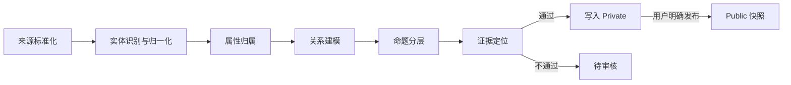

# Knowledge Compiler Agent

## 模型输出容错

模型输出先经过逐项标准化，再进入严格知识编译协议。可选字段中的 `null`
会被转换为空值；缺少实体标题、事实陈述、关系端点或关系类型的条目会被
隔离，不能写入 Neo4j。其他通过结构校验的实体、事实和关系继续进入审核，
任务状态为 `review_required`，并显示被隔离条目的原始位置和原因。

该容错只避免单个坏条目拖垮整次抽取，不会推测缺失的关系端点或关系类型，
也不会绕过证据定位和 public/private 审核规则。

## 目标

Knowledge Compiler Agent 将原始文字、文件和图片编译为有证据约束的 Private 知识草稿。LLM 只负责提出候选结构，确定性校验器决定候选是否可以写入 Neo4j。

编译通过不等于公开。Private 内容必须经过用户显式发布，才能生成 Public 快照。

## 状态机

## 编译规则

### 实体

- 必须是可以独立识别、复用和连接的对象。
- `Description`、`Attribute`、`Relationship`、`Fact`、`Hypothesis`、`Axiom` 不能作为实体类型。
- 同一批次名称归一化后不得重复。
- 必须包含定义和来源证据。

### 属性

- 必须归属于一个实体。
- 使用受限键名，不能覆盖 `id`、`ownerId`、`title` 等系统字段。
- 每个属性必须保存值和证据。

### 关系

- 起点和终点必须是当前草稿中已定义的两个不同实体。
- 类型必须使用英文大写蛇形命名。
- 必须包含自然语言描述和来源证据。
- 写库后保存模型、置信度和证据 Chunk。

### 命题

- Fact 只能表达一个可由原文直接核验的命题。
- 包含“可能、推测、建议、应该”等语气的命题不能作为 Fact，应进入 Hypothesis。
- Fact 必须至少指向一个实体。
- Hypothesis 必须包含前提、替代解释和可证伪条件。
- Axiom 不能由摄取 Agent 自动创建，只能通过 Public 治理流程产生。

### 证据

- 文字来源的证据必须能在标准化原文中逐字定位。
- 图片来源允许视觉证据，但仍保存图片资产、模型和生成结果。
- 任一实体、属性、关系或 Fact 缺少证据时，整个草稿进入 `review_required`。

## 输出状态

- `ready`：全部规则通过，可以写入 Private。
- `review_required`：存在结构或证据错误，禁止写库并返回逐条问题。
- `blocked`：写入阶段被编译器阻断。

每个问题包含稳定的错误码、JSON 路径和中文原因，前端预览会直接展示。
